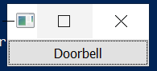
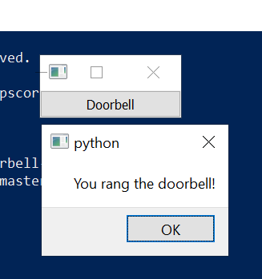

## Doorbell
This is a simple Python GUI application.

I used PyQt5 to create an application that produces a message once a button is clicked. It creates a window with a label
and a button. Once the button is clicked another message will pop-up on your computer giving a message. Once you click the
X button on the original window, the application will terminate.

